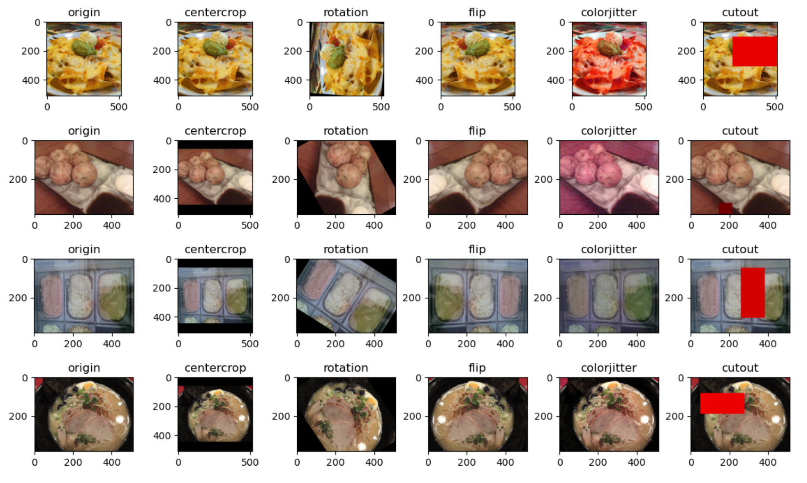
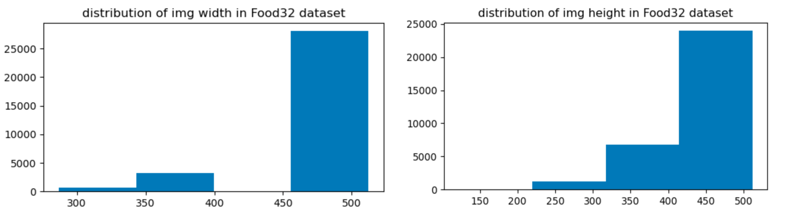

In this competition, our team (**4 angry men**) reached **Top-1** on the public leaderboard of the Kaggle competition: Transfer Learning on Food Recognition (MDS5210). Specifically, our solution achieves an accuracy of **0.8350 (public)** with the help of state-of-the-art backbone network, sufficient data augmentation, appropriate DA algorithm, and various learning strategies and tricks.

Our results on the Kaggle public leaderboard. For simplicity, we have abbreviated the names of some of the methods we use. Here, LM is the large model, DA is the data augmentation, IS is the image size, CD is the custom dataset, SSL is the self-supervised learning strategy, and DAM is the domain adaption method.

| ID | LM | DA | IS | CD | SSL | DAM | ACC      | Improve  |
|----|----|----|----|----|-----|-----|----------|----------|
| 1  | \- | \- | \- | \- | \-  | \-  | 0\.67124 | \-       |
| 2  | ✓  | \- | \- | \- | \-  | \-  | 0\.72289 | 0\.05165 |
| 3  | ✓  | ✓  | \- | \- | \-  | \-  | 0\.76663 | 0\.04374 |
| 4  | ✓  | ✓  | ✓  | \- | \-  | \-  | 0\.78247 | 0\.01584 |
| 5  | ✓  | ✓  | ✓  | ✓  | \-  | \-  | 0\.78731 | 0\.00484 |
| 6  | ✓  | ✓  | ✓  | ✓  | ✓   | \-  | 0\.79593 | 0\.00862 |
| 7  | ✓  | ✓  | ✓  | ✓  | ✓   | ✓   | **0\.82470** | 0\.02877 |

Then, we analyze the result one by one as follow.

**Baseline**. The baseline we use is the resnet50. We train this model for 50 epochs, with all other parameters set to default values, and finally achieved a result of 0.67124. I think the result is reasonable because I saw through the public leaderboard that many people started with a score of 0.67 or so.
    
**Large Model**. We believe the large model is helpful here intuitively because the dataset is not that easy. The Food32 dataset has 32 different classes and 1000 different images in one class. It is not enough to use a simple resnet50 to fit these data points well, both in terms of data volume and data diversity. In our experiment, we utilize the ConvNext-base as our backbone for feature extraction. Apart from that, we also further modify the original by utilizing IBN, which is a magic technology in the domain adaption field and generalization task by using instance normalization instead of batch normalization at the shallower layer of the backbone. Last, we also adjust the bottleneck dimension from 256 to 1024 since the output channel dimension of our backbone is exactly 1024, and we do not want to lose the information at the bottleneck. 
    
Note that we also try the ConvNext-large and ConvNext-small, and both the two models work worse than the ConvNext-base.
    
**Data Augmentation**. Data augmentation is really important in this task. Since this competition is a task of domain adaption and generalization, data enhancement can greatly increase the diversity and richness of data. The main data augmentation methods are shown in Fig below. Note that we find Cutout is really useful in this task. We know that there are also many other methods like Mixup, but we do not find them useful to our results. 

**Image Size**. The size of images is another important parameter. By EDA and data analysis, the size distribution of the training and testing datasets is shown in Fig below. By this figure, we know that the default image size (224) is not enough, and the average size is set at 512 which is more reasonable. This is because if it is set too large, then the computational cost becomes higher and the training time will be longer; on the contrary, if it is set too small, a lot of information about the original image will be inevitably lost in the compression process. Therefore, we think 512 is the better trade-off.

**Custom Dataset**. Using external datasets is a common technique in many competitions, and the Tianchi competition is a good example. However, since we do not know the name of each class in the Food32 dataset, we output and record the predicted class with the probability score for each score. By sorting, we know that class 17 and class 31 performed the worst. To this end, we use web technology to obtain more than 50 images for each class and retrain the model from random parameters. As we can see in the result, it can achieve some improvement but only a little. We do not obtain more images online because the quality of images online is not that good and has many noises.

**Self-Supervised Learning**. The pseudo label technology is used and we find it useful in our experiment. Also, we try different ratios between the number of original data and data with the pseudo label. In our experiment, we try 1:10 and 1:3 two different ratios. Last, we also try to use the different data at different stages, that is, training with the original data and the pseudo together, and training only with the original data at the final 5-10 epochs. 

**Domain Adaption Method**. Since this is a domain adaption competition, not only an image classification task, we also make some adjustments for the adaption loss function. For the baseline, the adaption method we use is DANN. However, this is one of the simplest methods in the field of domain adaption. Thus, for other most experiments, we only apply MCC. Here, we further fuse a variant of DANN, CDAN with MCC. We can see that the final transfer loss function is the combination of CDAN and MCC.

Note that after trying different domain adaption methods, we ensemble all these models together for inference.

**Others**. In this competition, we tried many different strategies. The methods above are the technologies we find useful. We also try test time augmentation (TTA), focal loss, sce loss, mixup, labelsmooth and swa.
